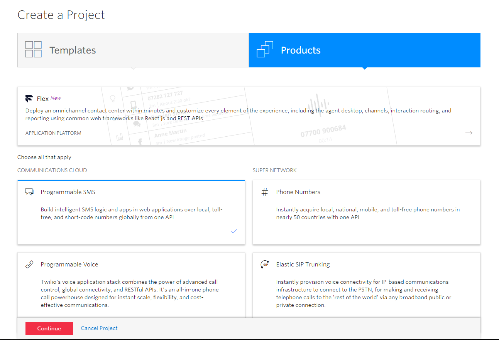
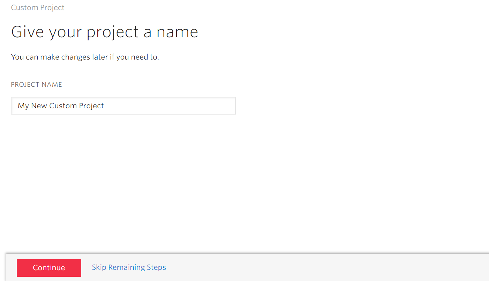
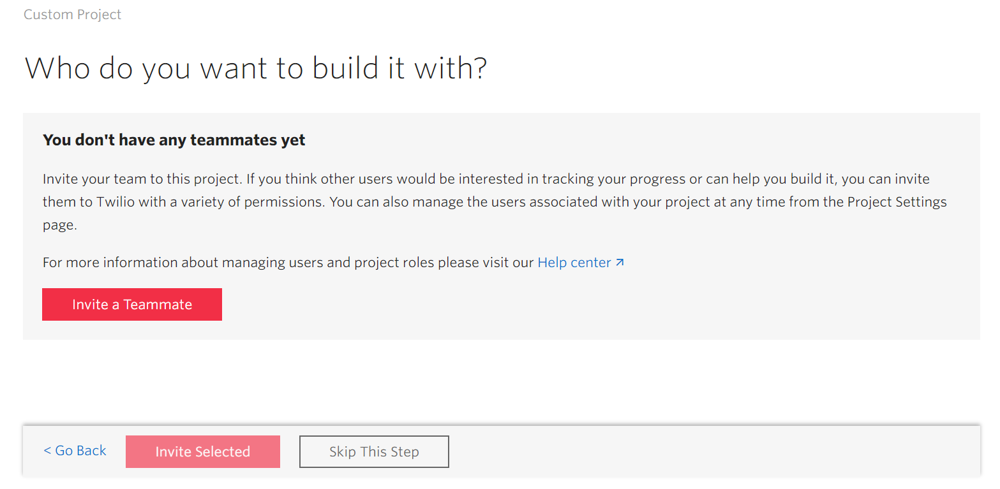
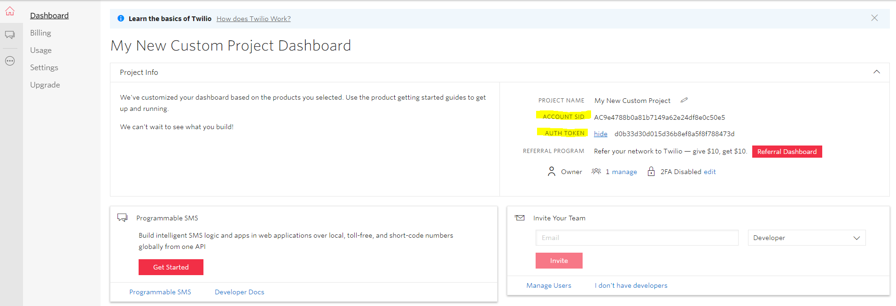
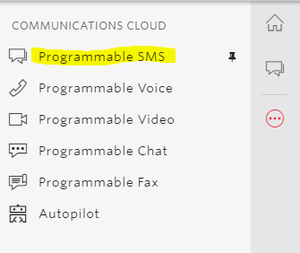
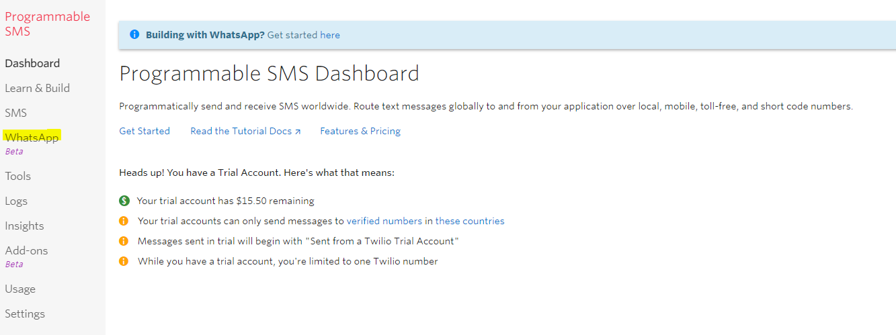
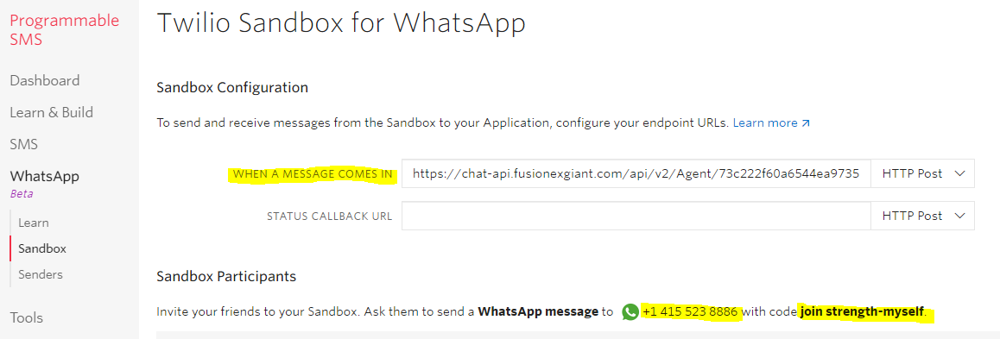
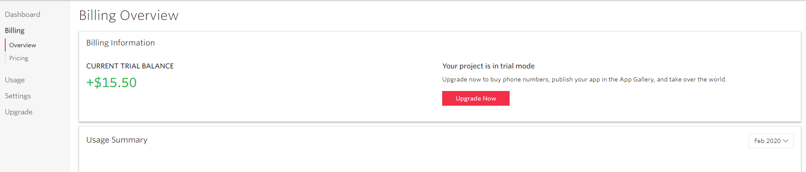

## Getting Started

This guide will assist on setting up Whatsapp Integration with AVA Chatbot.

## Twilio Sign Up Flow

1. Sign up Twilio Account at [Twilio Registration Page](https://www.twilio.com/try-twilio)
2. Verify Twilio Account through verification email sent to the email used for the registration (Once verified, you will automatically be logged in)
3. Add a Phone Number for verification.
4. Get the verification code from the received SMS in the phone entered in step 3 and input.
5. Create Twilio Project at [Twilio Create a Project Page](https://www.twilio.com/console/projects/create)
6. Project Creation Flow
>- 6.1 Click on `Products`
>- 6.2 Click on `Programmable SMS`
>- 6.3 Click on `Continue`

>- 6.4 Key in the Project Name and Continue

>- 6.5 Skip the process on inviting teammates by clicking "Skip this Step"

## Twilio Sandbox Setup (Development)

1. Open and click on the newly created Twilio Project in Twilio Console on the top left.
2. Get Auth SID and Auth Token from [Project Home Console](https://www.twilio.com/console)

3. Pass the Auth SID and Auth Token to the AVA Chatbot Service Admin (supervisor), to allow AVA Service to get the credentials to access Twilio Sandbox.
4. Get the AVA Chatbot Webhook URL from AVA Chatbot Service Admin (supervisor)
> Another way to get the AVA Chatbot Webhook URL Access Token is by running the Chatbot Simulator through GIANT and cross referencing its URL to the Sample URL
(if it is already existing)
> Sample URL: `https://chat-api.fusionexgiant.com/api/v2/Agent/<agentId>/Whatsapp/Webhook/Twilio?=<AccessToken>`

> Sample AVA Chatbot Webhook URL `https://chat-web.fusionexgiant.com/#/73c222f60a6544ea9735befa0b59a940?t=7e0f34a55bbb4e5824489d90e654113eec31d3cd55703b170aae5f5d6ce5c4055f2309fe442d8a378f92a52a38b63403`
5. Replace `<agentId>` and `<AccessToken>` from the Sample URL with the information of the new AVA Chatbot Webhook URL
> Sample URL for Twilio: `https://chat-api.fusionexgiant.com/api/v2/Agent/73c222f60a6544ea9735befa0b59a940/Whatsapp/Webhook/Twilio?=7e0f34a55bbb4e5824489d90e654113eec31d3cd55703b170aae5f5d6ce5c4055f2309fe442d8a378f92a52a38b63403`

>NOTE: It is very important to ensure that this step is completed **BEFORE** progressing to other steps within this documentation.
6. Open Side Panel (All Products and Services) and Click on `Programmable SMS`.

7. Click on `Whatsapp` on the second level side panel.

8. Click on `Sandbox` on the third level side panel, details to be displayed include:-
>- Sandbox Webhook URL
>- Sandbox Phone Number
>- Sandbox Joining Init Phrase (e.g. `join strength-myself`)

9. Configure Webhook URL based on the Sample URL for Twilio in step 5.
>NOTE: To verify if the Webhook URL field in the sandbox is **CHANGED** after saving, please do save it **TWICE** to change it to a new Webhook URL
10. Open your Whatsapp Software, send the message based on the `init phrase` and `phone number` from step 8.
11. Start sending messages to the sandbox phone number and ensure the webhook is working and is able to get the expected responses.

## Twilio Billing

1. To check on the remaining credit for a specific project, access the [Twilio Project Billing Page](https://www.twilio.com/console/billing)

